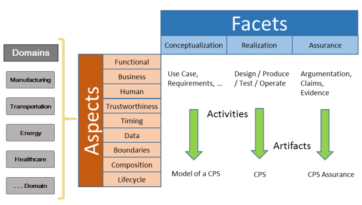
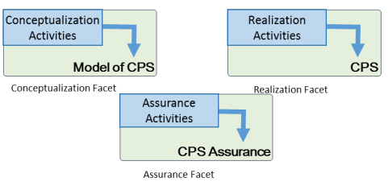

# FEDERATED CUBESAT SYSTEM

[CPS Framework](https://pages.nist.gov/cpspwg/)

It is a COLLABORATIVE SoS -- comprise constituent systems which voluntarily choos eto participate to fulfill some central purposes, which can evolve based on collaboration between constitutents and SoS. There is no overall  directing authority. Constituent systems adhere to standards and regulations but can negotiate individually to evolve roles and working practices. (INCOSE SoS Primer)

## SoS Pain Points

Dahmann, 2013. System of Systems Pain Points. INCOSE International Symposium.

1. Testing, Validation and Learning (How can SE approach SoS validation, testing and continuous learning in SoS?)  
2. Leadership (What are the roles and characteristics of effective SoS leaders?)  
3. Constituent Systems (What are effective approaches to integrating constituent systems?)  
4. Capabilities and Requirements (How can SE address SoS capabilities and requirements?)  
5. Autonomy, Interedependencies and Emergence (How can SE address the complexities of SoS interdependancies and emergent behaviours?)  
6. Principles (What are the key SoS thinking principles?)  
7. Authorities (What are the effective collaboration patterns in SoS?)  

### Authorities

SoS are comprised of multiple independent systems.
Each participating system has its own local "owner" with its stakeholders, users, business processes and development approach.
SE relies on cross cutting analysis and on composition and integration of constituent systems.
The focus is on creation of the incentives and development environment which allow thee systems to proceed to meet their own objectives while working cooperatively to support broader objectives.  

### Leadership

The challenge of leadership in the multiple organizational environment of an SoS.
Lack of structured control normally present in SE of sytems requires alternatives to provide coherence and direction, such as influence and incentives.

The organizational and technical complexity of SoS, with multiple independent stakeholders with their own interests, independence and cognitive biases, requires strong leadership to identify and assess technical options for SoS architecture, as well as options and strategies for coping with change/evolution.

SoS systems engineers to take a broad perspective and posses the ability to appreciate the perspectives of the constituent systems so they can organize and lead a cross organization SE team to find effective and acceptable solutions for development and evolution of cross cutting SoS capabilities while respecting the independent needs of the constituent system.

### CS Perspectives

## CyberPhysical Systems Framework

The first goal was to derive a unifying framework that covers the range of unique dimensions of CPS.  
The second goal is to populate a significant portion of the CPS Framework with detail.  

1. Identify domain: stakeholders may have domain-specific and cross-domain concerns.  
2. Identify cross-cutting concerns: stakeholders can have concerns that overlap or are instances of broader conceptual concerns.  
3. Analyze cross-cutting and produce aspects.  
4. Address concerns (aspects): within 3 fundamental facets of conceptualization, realization and assurance.  

Domain --> Aspects (Functional, Businness, Human, Trustworthness, Timing, Data, Boundaries, Composition, Lifecycle) --> Facets (Conceptualization, Realization and Assurance)

- Model : What things should be and what things are supposed to do.
- Instance : How things shold be made and operate
- Assurance : How to prove things actually work te way they should.

### Conventions

An _architecture framework_ consists of the "convetions, principles and practices for the description of architectures established within a specific domain of applicaiton and/or community of stakeholders"  

A _concern_ is an "interest in a system relevant to one or more of its stakeholders"  

An _architecture view_ consists of "work product expressing the architecture of a system from the perspective of specific system concern"  

An _architecture viewpoint_ consists of "work product establishing the conventions for the construction, interpretation and use of architecture views to frame specific system concerns"  

### Key Elements of CPS Framework

  

**Domain** -- the different application areas of CPS  
**Concerns** -- different stakeholders in unique and collective viewpoints, fundamental concept that drives the CPS framework  
**Properties** -- concrete assertions that address the concerns (requirements, design elements, tests, judgements)  
**Aspects** -- grouping of conceptually equivalent or related concerns  
**Facets** -- views of the CPS encompassing identified resposibilities in the systems engineering process

### Steps

1. **Identify** concerns  
2. **Analyze** to produce aspects  
3. **Address** through activities and artifacts

The primary goal of the CPS Framework is to be _actionable_.  

A **fact**, therefore, is a collection of activities that produce artifacts taht are driven by **aspects** and their concerns for a CPS.  

The analysis of CPS can be viewed from any aspect adn assembled by navigating one or more times through the aspects to obtain the complete view of the CPS.  

### Properties

The _conceptualization facet_ comprises teh set of activities and artifacts that produce a model of CPS.  

A realied and assembled "CPS Model" is an instance of a CPS.  
The CPS model is the theoretical ideal of the CPS.  

The _realization facet_ and its activities strive to quantitatively satisfy the aspirational properties of the conceptualization facet.  

The _assurance facet_ then provides the assurance that the conceptualization was realized as _intetended_.  

Elements of the assurance case of a CPS consists of statements built from data produced during the activities of the first two facets of the framework.  
 
- claims  
- evidence  
- argumentation  
- estimate of confidence  

> "The [Evidence] is sufficient to conducted that the [Claims] are true based on the [Argumentation] with this [Estimate of Confidence]"  

This is an _assurance judgement_.

### Concerns to Aspects

Concerns and aspects are not orthogonal.  
Within teh analysis of a given concern, consideration muast also be given to related concerns.

### Activities and Artifacts

Activities may refer to individual activities or activities groups.  
Each activity produces one or more artifacts, which are teh concrete technical components used to document teh results.  

## Applying the CPS Framework

The discussion is limited to:  

- The interfaces to the CPS devices and systems involved in the scenario and not the architecting of these systems and devices  
- A complete analysis of this and its component systems would include all the properties, full design, and full assurance cases of the component systems and this system  

### Workflow

Determine Scope of Analysis >> Tailor Framewoork Facet >> Perfom Conceptualization >> Perform Realization >> Perform Assurance

### Coverage Use Case

``"Different Satellites covers the DCP area and transmits the data to Ground Station"``  

A satellite overpasses the DCP area. The satellite receives the data through UHF channel, process it, storage it and download it to a Ground Station. Another satellite should pass over the same DCP in less than one hour.

**Systems** 
- DCP
- Satellites
- Ground Station

**Steps**  
- The DCP starts transmitting the environmental data (blind and continuous mode)  
- A satellite overpasses the DCP area  
- The satellite start receiving tha environmental data  
- The Ground Station starts tracking the satellite  
- The satellite starts communicating with the Ground Station
- The Ground Station sends a command to the satellite to start the data download  
- The satellite sends the data to the Ground Station
- Another satellite overpasses the samew DCP in less than one hour

**Success**
- The ground station correctly receives the environmental data from a specific DCP

**Variations**
- Different satellites overpasses the same DCP and receive the same data, the Ground Segment should be capable to validate the data  
- Different satellites overpasses the Ground Station at the same time, a priority order should be implemented  

### Scope of Analysis

- Process -- _Gap-analysis_: analyze a set of CPS including systems of CPS and compare to discover gaps and overlaps for Pivotal Points of Interoperability. Understanding the opportunities for integration or gap-filling informs holistic 
tradeoff decisions about integrating systems and capabilities.

- Depth -- _Loosely-coupled CPS_: Especially appropriate for applications of CPS that repurpose capabilities of existing CPS and integrate them in new and novel ways, a lighter emphasis on hard requirements and a greater weight on functional goals are sought.

- Scope -- _SoS_: A system of interconnected systems.  

- Domain -- _Aerospace / Environmental Monitoring_

### Tailor Conceptualization Activities, Aspects and Concerns

- Functional Decomposition -- Detailed Use Cases, actors, information exchanges
- Requirement Analysis -- Functional and Non-functional requirements

#### Functional Decomposition

